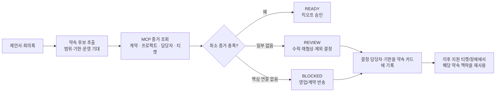

# Promise-to-Proof Gate — 실행 워크플로우

## 결론

이 기능의 이름을 **Promise-to-Proof Gate**로 고정한다.

> **영업이 고객에게 한 약속이 계약·프로젝트·운영 책임으로 연결됐다는 증거가 없으면, 구축 킥오프를 ‘승인 대기’로 전환하는 MCP 기반 인수인계 게이트.**

이것은 ‘제안서를 요약하는 AI’가 아니다. 고객에게 이미 팔린 기대가 구축과 운영에서 증발하는 사고를 **프로젝트 시작 전에** 잡는 업무 통제점이다.

## 해결하려는 손실: 검색 시간이 아니다

| 오늘의 흐름 | 손실이 생기는 지점 | Gate 이후 바뀌는 행동 |
|---|---|---|
| 영업이 제안서/회의에서 범위·기한·운영 기대를 약속 | 계약서와 프로젝트에 일부만 기록 | 약속마다 계약·프로젝트·책임자 연결을 확인 |
| PM이 프로젝트를 킥오프 | 숨은 조건을 나중에 발견하여 재작업 또는 무상 범위 확대 | 미연결 약속을 수락·재협상·제외 중 하나로 처리해야 킥오프 가능 |
| 지원팀이 장애를 처리 | 왜 이 고객이 민감한지, 어떤 기대와 충돌하는지 모름 | ‘고객 약속’ 맥락이 붙은 티켓으로 에스컬레이션 |

따라서 성공 지표는 RAG 정확도나 “요약 시간”이 아니다.

1. 킥오프 전에 발견된 미연결 약속 수
2. 각 미연결 약속에 대해 실제로 내려진 결정(수락·재협상·제외) 비율
3. 킥오프 이후 ‘제안에 있었는데’로 인한 재작업/에스컬레이션 건수

세 번째는 현재 데이터셋에서 실측할 수 없으므로, 데모에서는 1·2만 주장한다.

## 사용자는 단 한 번만 들어온다

**트리거:** PM이 프로젝트를 `planning → kickoff-ready`로 넘기려 할 때.

PM은 챗봇에 질문하지 않는다. 시스템이 MCP로 ‘약속 검사’를 실행하고 결과가 세 가지 중 하나로 나온다.

| 상태 | 의미 | PM이 할 일 | 단계 전환 |
|---|---|---|---|
| `READY` | 약속별 최소 증거가 모두 존재 | 승인 | 진행 |
| `REVIEW` | 약속은 있으나 증거가 부족하거나 상충 | 수락·재협상·제외 사유를 선택 | 결정 전 보류 |
| `BLOCKED` | 고객/제품/계약 자체가 연결되지 않음 | 영업·계약 담당자에게 반송 | 진행 불가 |

이 강제 선택이 없으면 단순 대시보드다. 이 선택이 있으므로 업무 시스템이다.

## 한 장짜리 업무 흐름



## ‘컴파일’의 정확한 뜻

LLM은 문장을 읽어 **후보**만 낸다. 이 후보가 승인 게이트에서 효력을 가지려면 사람이 확인 가능한 규칙으로 바뀌어야 한다.

```json
{
  "promise_id": "P-DOC031-02",
  "source": {"document_id": "DOC-031", "quote": "2단계 (7주): 구축 및 마이그레이션"},
  "customer": "Client-F",
  "product": "Product-C1",
  "type": "delivery_timeline",
  "minimum_proof": [
    "customer_product_contract",
    "linked_delivery_project",
    "named_delivery_owner"
  ],
  "decision": null
}
```

`약속을 지켰다`는 추론하지 않는다. **필요한 증거가 있는지**만 결정론적으로 판정한다. 문장의 ‘31% 비용 절감’처럼 원본 데이터가 검증할 수 없는 효과 약속은 `REVIEW`로만 보내며, 성공/실패를 판정하지 않는다.

## 최소 증거 규칙 4개

| 약속 유형 | READY 조건 | 증거가 없을 때 |
|---|---|---|
| 도입/구축 범위 | 고객·제품이 일치하는 유효 계약, 연결 프로젝트, PM | `BLOCKED` 또는 `REVIEW` |
| 기한 | 위 3개 + 프로젝트 종료일/마일스톤 | `REVIEW` |
| 운영 지원 | 유효 유지보수/구독 계약, 담당자, 해당 제품 지원 이력 | `REVIEW` |
| 정량 효과(비용·시간 절감) | 데이터셋에 측정 원천과 기준선이 있을 때만 | 현재는 항상 `REVIEW` |

## Company-X로 보여줄 수 있는 진짜 장면

`DOC-031`은 Client-F에게 **Product-C1 도입**, **12주 구축·마이그레이션**, **상시 운영 지원**을 제안한다. 하지만 데이터의 Client-F 계약은 Product-C2(유지보수)와 Product-S2(구독)이고, Product-C1 계약/연결 프로젝트는 확인되지 않는다. 그러므로 정직한 결과는 ‘이행 중’이 아니라 아래다.

```text
BLOCKED — Client-F / Product-C1 도입 약속

원문: DOC-031, “2단계 (7주): 구축 및 마이그레이션”
확인됨: 고객(Client-F)
확인되지 않음: Product-C1 계약, 연결 프로젝트, 구축 책임자
자동 판정: 킥오프 불가
반송 대상: 영업 담당자·계약 담당자
필요 결정: 계약 제품 정정 / 프로젝트 생성 / 제안 범위 제외
```

이건 모델이 만든 드라마가 아니라 데이터의 불일치를 이용한 **실제 검증 데모**다. 기존 RAG라면 DOC-031을 잘 찾아주는 것으로 끝난다. 이 워크플로우는 ‘이 문서대로 시작해도 되는가?’에 답하고, 안 되면 누가 무엇을 고칠지 지정한다.

## MCP 설계: 최소한으로, 그러나 폐루프

| 순서 | MCP 도구 | 반환값 | 역할 |
|---:|---|---|---|
| 1 | `vector_search` | 문서 ID·원문 문장·문서 유형 | 약속 후보의 출처 고정 |
| 2 | `run_sql` | 고객/제품 일치 계약, 프로젝트, 상태, 담당자 | 계약과 납품 증거 확인 |
| 3 | `kg_search` | 고객–제품–담당자 관계 | 책임 공백의 보조 확인 |
| 4 | `promise_proof_gate` | 상태, 누락 증거, 반송 대상, 결정 양식 | 결정론적 판정 및 업무 전환 |
| 5 | `record_promise_decision` | 수락·재협상·제외, 담당자, 기한, 근거 | 사람이 닫는 피드백 루프 |

4번은 새로 만들 MCP 도구다. 5번은 기존 원본 데이터는 건드리지 않고 별도 `promise_decisions` 테이블에 감사 가능하게 기록한다.

## 왜 ‘MCP 기반’이어야 하는가

이 아이디어는 MCP가 없어도 개념상 가능하다. 하지만 MCP가 있을 때 **증거를 가져오는 경로와 판정기를 분리**할 수 있다.

- 계약 DB, 문서 벡터 검색, 관계 그래프가 각각 표준 도구로 노출된다.
- `promise_proof_gate`는 특정 DB 스키마·임베딩 구현에 묶이지 않고, 세 도구의 구조화된 결과만 받는다.
- 따라서 리원에이스가 실제 고객 환경에서 DB 튜닝·VectorDB·MCP/RAG·MSP를 함께 제공하는 방식과 맞는다. 고객마다 데이터 원천이 달라도 ‘약속 → 최소 증거 → 승인’ 규칙은 유지된다.

MCP 자체를 가치로 팔지 않는다. **고객 약속의 증거 사슬을 원천 시스템 간에 싸게 검증하게 해 주는 수단**이다.

## 냉정한 반대 의견과 설계 방어

| 심사위원 반대 | 답변 | 설계상 방어선 |
|---|---|---|
| “CLM이나 CRM도 하는 일 아닌가?” | 계약 관리나 인수인계는 한다. 운영 데이터까지 증거로 연결하여 프로젝트 단계를 막지는 않는다. | 기능 범위를 ‘계약 생성’이 아니라 ‘킥오프 증거 게이트’로 고정 |
| “LLM이 약속을 잘못 추출하면?” | 그래서 자동 차단하지 않는다. 후보는 원문과 함께 PM이 확인하고, 자동 판정은 확정된 후보의 DB 연결만 한다. | 원문 보존, 확정 전 `candidate`, 확정 후 `commitment` |
| “증거가 없다고 미이행은 아니다.” | 맞다. 결과는 ‘미이행’이 아니라 `증거 없음`이다. | `UNPROVEN`과 `CONTRADICTED`를 절대 혼동하지 않음 |
| “프로젝트 관리 툴에 체크리스트면 되지 않나?” | 체크리스트는 사람이 기억해야 한다. 이 시스템은 제안서 문장 자체에서 체크 항목을 만들고 3개 원천을 대조한다. | 출처 문장, 계약/프로젝트 관계, 담당자 증거를 함께 요구 |
| “데이터셋에서 효과를 증명 못 한다.” | 매출·이탈 효과는 주장하지 않는다. 데이터로는 실제 문서-계약 불일치 발견과 판정 정확도만 증명한다. | 별도 20~30개 약속–증거 골드셋으로 평가 |

## 구현 순서: 데모가 아니라 쓸 수 있는 최소 제품

1. **증거 모델** — `promise_decisions`, `promise_evidence` 두 테이블과 상태 전이(`candidate → review → ready/blocked`)를 만든다.
2. **고정 규칙 4개** — 위 최소 증거 규칙만 SQL로 구현한다. 정량 효과 판정은 의도적으로 제외한다.
3. **MCP 도구 2개** — `promise_proof_gate`, `record_promise_decision`을 Air 서버에 추가하고 입력/출력 스키마를 명시한다.
4. **PM 화면 한 장** — 고객/문서 선택 → 약속 카드 → 누락 증거 → 결정 버튼. 채팅 UI는 보조다.
5. **평가** — 사람 2명이 DOC-031 등 제안서·회의록에서 약속과 상태를 라벨링하고, 규칙 결과와 불일치 이유를 공개한다.

## 심사에서 던질 한 문장

> “AI에게 제안서를 잘 읽게 한 게 아닙니다. 고객에게 한 말이 계약·프로젝트·운영의 책임으로 이어졌다는 증거가 없으면, 일을 다음 단계로 넘기지 못하게 했습니다.”
